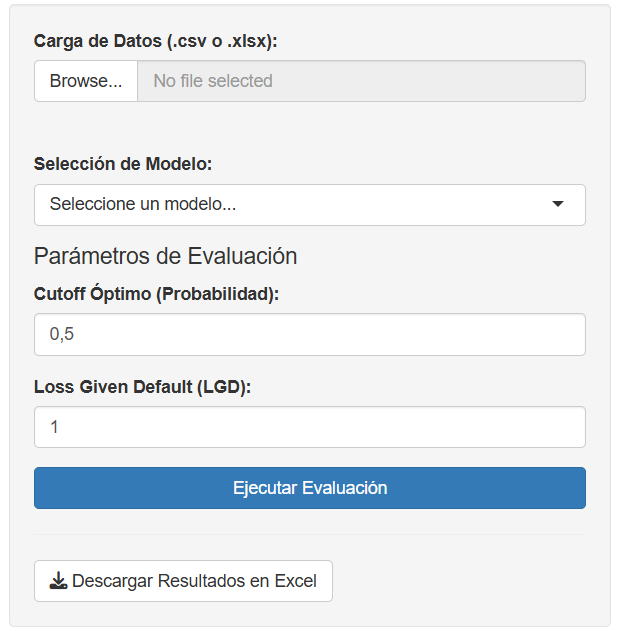
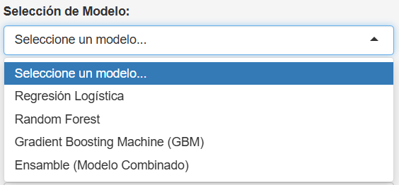
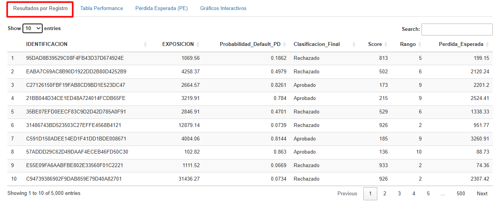
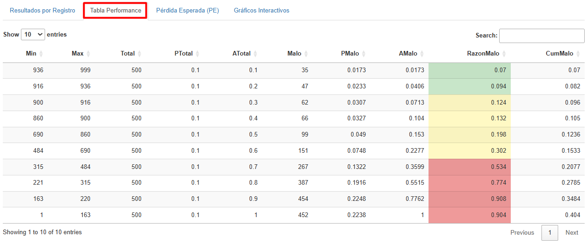
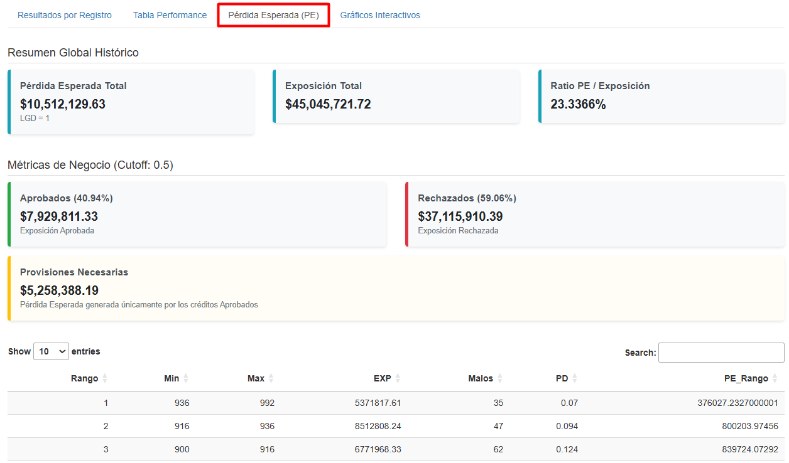
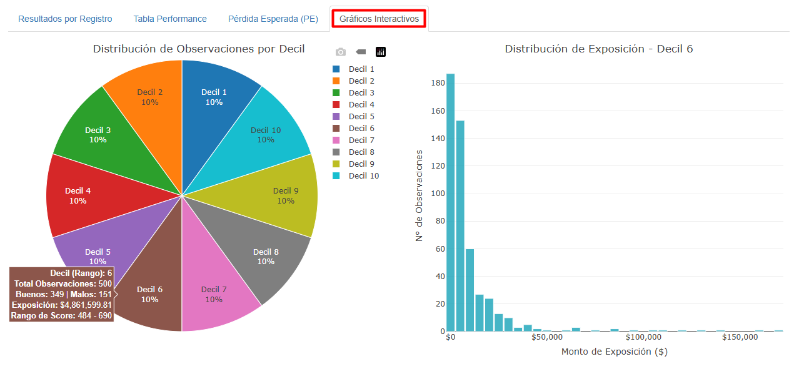

**Autores:**

- Alomoto Rivera Martin Sebastian
- Lara Del Salto Daniel Sebastian
- Simbaña Valencia Jennifer Pamela

## 1. Introducción

\

El presente documento describe el funcionamiento del aplicativo web desarrollado en R Shiny para la evaluación de solicitantes de crédito utilizando modelos predictivos de riesgo.

El sistema permite cargar una base de clientes, seleccionar un modelo de clasificación preentrenado y obtener automáticamente la probabilidad de incumplimiento (Probability of Default o PD), el Score crediticio, las tablas de performance y las métricas de desempeño del modelo.

Adicionalmente, el aplicativo estima la pérdida esperada de la cartera y evalúa el impacto financiero de las decisiones de aprobación y rechazo mediante la metodología estándar utilizada en la gestión de riesgo de crédito.


## 2. Requisitos Previos y Preparación de Datos

\

Para que el programa funcione correctamente, se requiere que el archivo de entrada, en formato CSV o XLSX, cumpla con la estructura de variables con la que fueron entrenados los modelos.

**Variables Obligatorias:**

-  `IDENTIFICACION`: Identificador único del cliente o solicitud.

<!-- -->

- `EXPOSICION`: Monto total adeudado o capital solicitado (necesario para el cálculo de la Pérdida Esperada).

- `VarDepF`: Variable dependiente real (0 para clientes Buenos, 1 para clientes Malos). Si se evalúan datos nuevos sin maduración, la columna debe existir aunque esté vacía.

- **Variables predictivas:** El archivo debe contener variables de la *Trama 1* de Buró Crediticio (como `CUOTA_EST_OP`, `TOT_CUPO`, `NOPE_VENC_OP_3M`, etc.). 





## 3. Descripción de la Interfaz y Parámetros

\

El panel lateral izquierdo centraliza todas las configuraciones necesarias para ejecutar la evaluación.

```{r echo=FALSE,fig.cap="Vista general del panel de configuración lateral",fig.align='center',out.width="45%"}

```

1.  **Carga de Archivo:** Utilice el botón "Browse..." para buscar y cargar su base de datos local. La barra de progreso indicará cuando la carga esté completa ("Upload complete").
2.  **Selección de Modelo:** A través del menú desplegable, elija el motor predictivo a utilizar.

```{r echo=FALSE,fig.cap="Menú desplegable de modelos",fig.align='center',out.width="50%"}

```

- **Regresión Logística:** Modelo estadístico tradicional.

- **Random Forest:** Algoritmo de ensamble basado en árboles de decisión múltiples.

- **Gradient Boosting Machine (GBM):** Modelo de ensamble secuencial optimizado para alta precisión.

- **Ensamble (Modelo Combinado):** Arquitectura avanzada H2O que apila predicciones de GBM, Regresión Logística y Redes Neuronales para maximizar la capacidad predictiva.

3.  **Configuración del Cutoff:** Establezca el punto de corte de probabilidad ($PD$) para la decisión crediticia. Todo registro con una probabilidad superior a este umbral será clasificado como "Rechazado". Un cutoff de 0.5 es estándar, pero se recomienda ajustarlo según la política de riesgo y apetito de la entidad.

4.  **Loss Given Default (LGD):** Ingrese la tasa de Pérdida Dado el Incumplimiento. Representa el porcentaje de la exposición que la institución espera perder en caso de que el cliente caiga en default. Por defecto es 1 (pérdida del 100%).

5.  **Ejecución y Descarga:** Al pulsar el botón "Ejecutar Evaluación", el sistema procesará los datos. Una vez finalizado, puede exportar todos los resultados haciendo clic en "Descargar Resultados en Excel".


## 4. Resultados Generados

\

El aplicativo distribuye los resultados en cuatro pestañas principales ubicadas en el panel central.

#### 1. Resultados por Registro

Esta pestaña presenta una tabla detallada a nivel de cliente individual.

```{r echo=FALSE,fig.cap="Tabla de Resultados por Registro",fig.align='center',out.width="80%"}

```

Por cada individuo, se visualiza su exposición monetaria, la Probabilidad de Default ($PD$) calculada por el modelo, la decisión final (Aprobado/Rechazado) basada en el Cutoff, el Score transformado (en escala de 0 a 1000), el decil de riesgo (Rango) y la Pérdida Esperada individual.

#### 2. Tabla Performance

Muestra la capacidad de ordenación y discriminación del modelo seleccionado dividiendo a la población en deciles (10 rangos).

```{r echo=FALSE,fig.cap="Tabla de Performance Del Modelo",fig.align='center',out.width="100%"}

```

Los deciles superiores concentran a los clientes de menor riesgo, mientras que los inferiores agrupan a los de mayor riesgo. La columna `RazonMalo` (tasa de malos por decil) cuenta con una semaforización automática (Verde - Amarillo - Rojo) que facilita la identificación visual de los tramos de mayor riesgo en la cartera.

#### 3. Pérdida Esperada (PE)

Una vez procesados los datos, el aplicativo calcula automáticamente la Pérdida Esperada global y el impacto en el negocio:

```{r echo=FALSE,fig.cap="Pestaña de Pérdida Esperada y métricas de negocio",fig.align='center',out.width="100%"}

```

La estimación se realiza mediante la fórmula:

$$ PE_i = PD_i \times LGD_i \times EXP_i $$

Donde: 

- $PD_i$: Probabilidad de Default estimada por el modelo. 

- $LGD_i$: Pérdida Dado el Incumplimiento (configurada en el panel lateral). 

- $EXP_i$: Representa el saldo adeudado o capital prestado (Exposición).


Esta sección incluye paneles de resumen ejecutivo que indican la Exposición Total, la Pérdida Esperada global y el volumen monetario de créditos Aprobados frente a los Rechazados. Adicionalmente, calcula las provisiones teóricas necesarias generadas exclusivamente por la cartera que el modelo decidió aprobar.

## 4. Gráficos Interactivos

\

Proporciona un entorno visual dinámico para explorar la distribución del riesgo en la cartera.

```{r echo=FALSE,fig.cap="Pestaña de Gráficos Interactivos",fig.align='center',out.width="100%"}

```

- **Distribución de Observaciones por Decil:** Un gráfico de pastel interactivo. Al posicionar el cursor sobre una sección, se despliega una tarjeta de información detallando el rango del decil, el volumen de observaciones, la segmentación histórica de clientes Buenos/Malos, la exposición total acumulada en ese segmento y los límites del Score.

- **Distribución de Exposición (Histograma):** Este panel reacciona directamente al gráfico de pastel. Al hacer clic sobre cualquier decil específico, el sistema renderiza automáticamente un histograma detallado que ilustra cómo se distribuyen los montos de exposición ($EXP$) únicamente para los individuos pertenecientes a ese nivel de riesgo.
